# Rollers
Колёсная платформа, которую можно быстро снять и надеть на любую обувь. Для передвижения в больших офисах. 

# Схожие дизайны
## Liekick
[Liekick](https://liekick.com/?srsltid=AU7gw4VOlcTDKTnh3imfpG71P88yWpCCap9wBOsGJWBUIqUC6hTPLzUQ) - кроссовки, совмещённые с роликами с возможностью быстро достать колёсики.
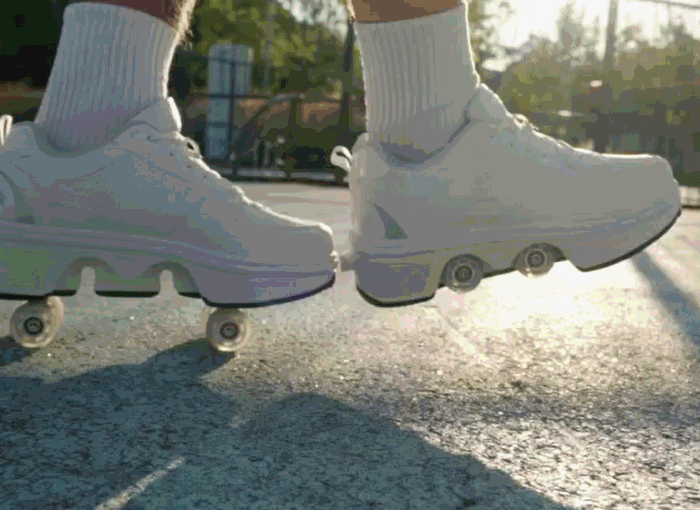

## Wheelfeet 2
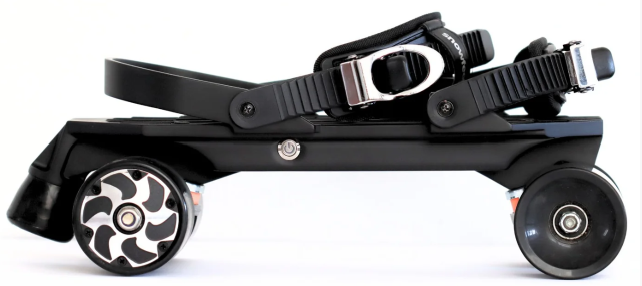

## Oldschool
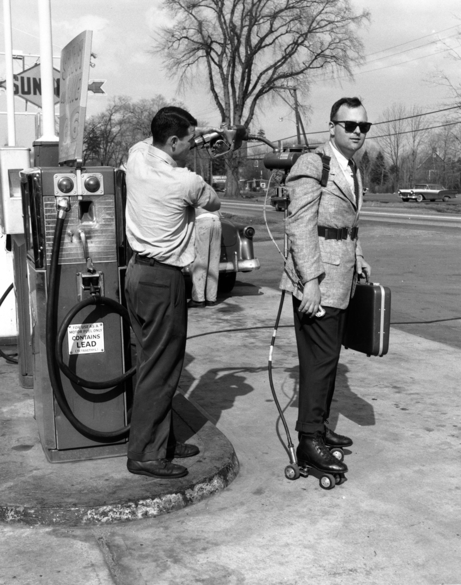
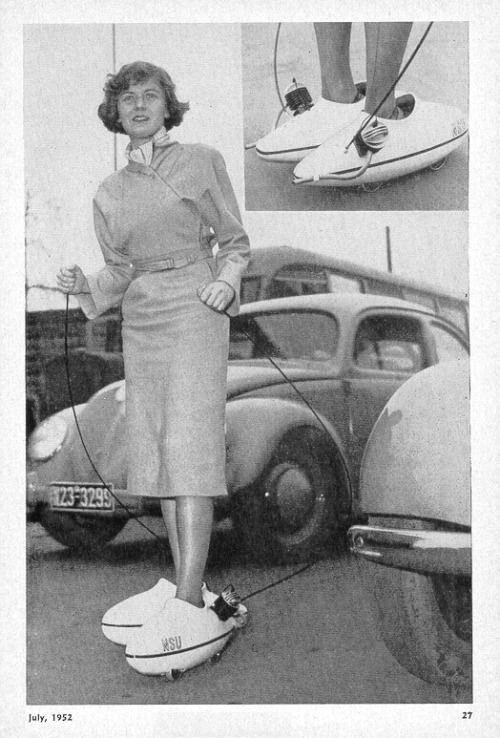
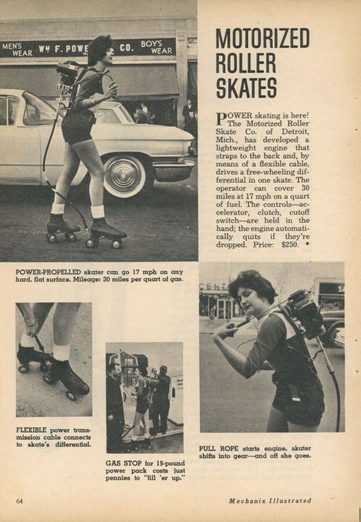
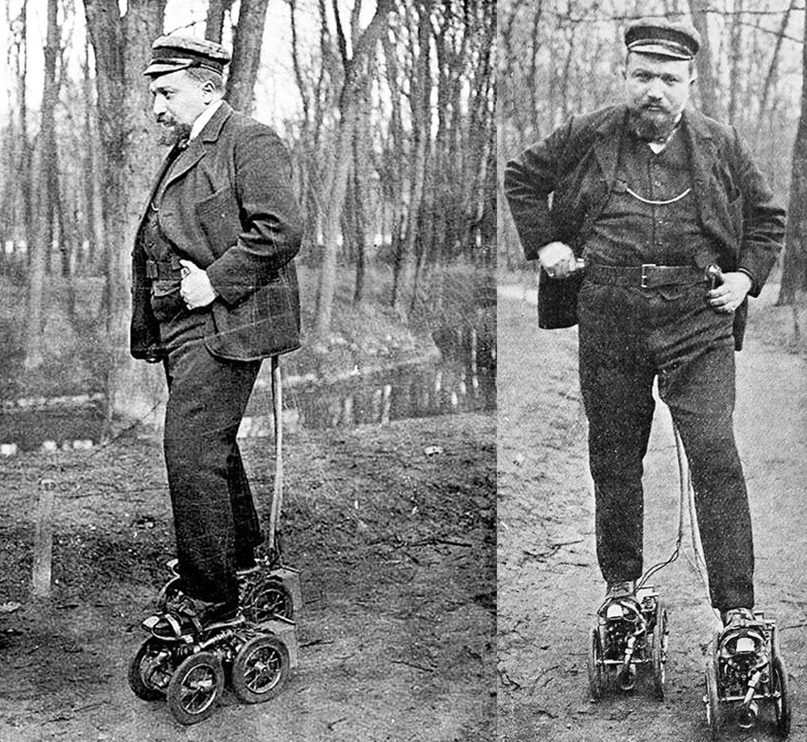

[Источник](https://www.hagerty.com/media/automotive-history/the-century-old-quest-to-create-motorized-skates-for-the-masses/)

# Design renders
Варианты дизайна в исполнении бежевого пластика, напечатанном на 3д принтере  
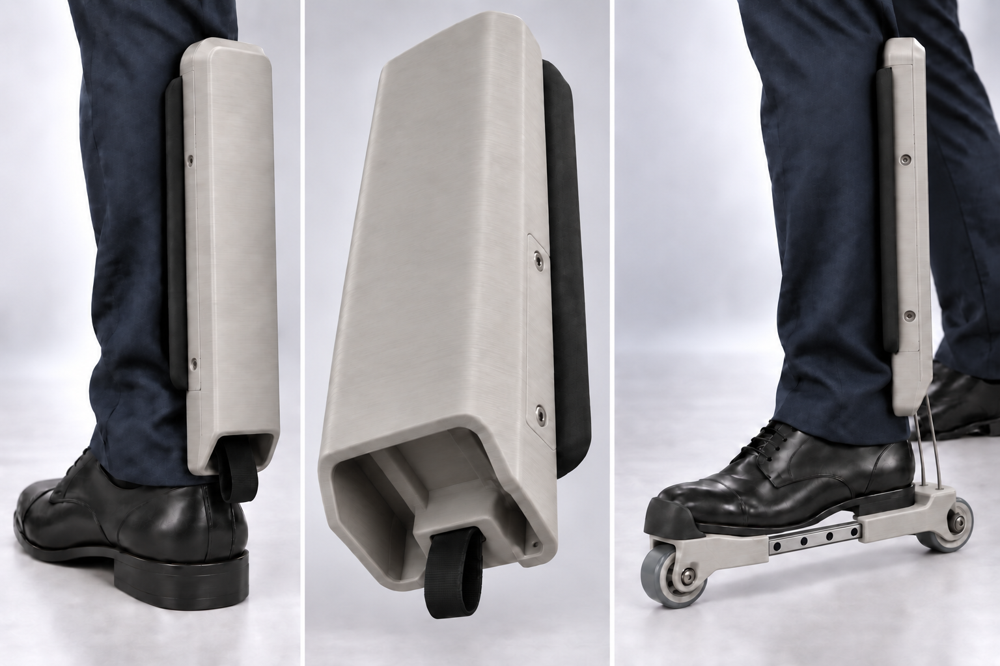  
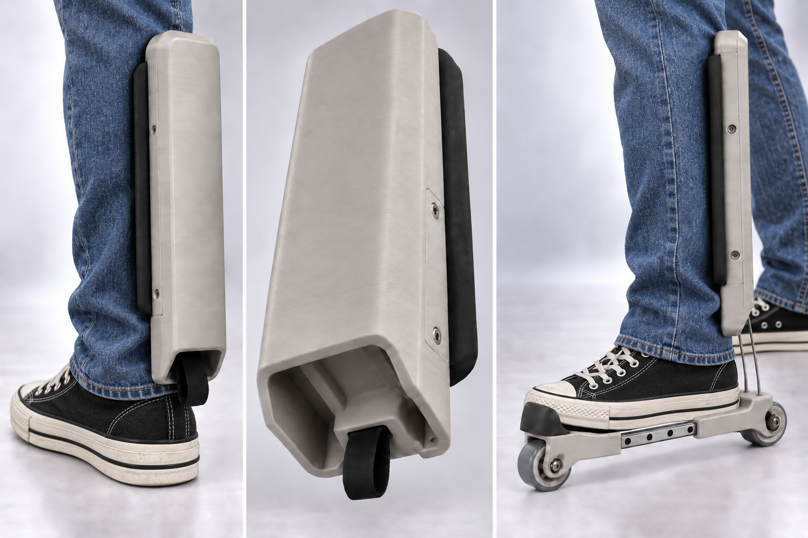  

# Proof-of-concept

На одной голени человека надет эластичный носок, в который вшиты 2 прорезиненных магнита  
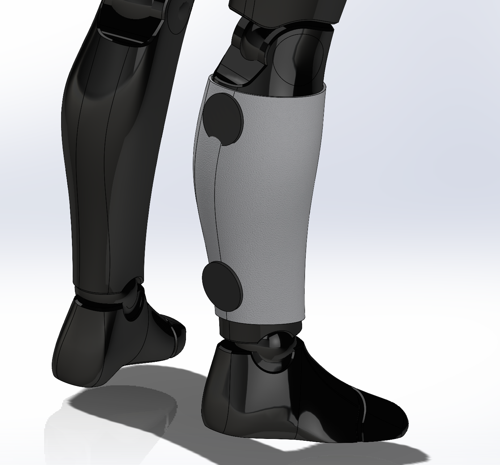  
Поверх носка надевается любая одежда - джинсы/брюки/etc.  
К этой части примагничивается сборка роллеров, в которых ответно есть также 2 прорезиненных магнита  
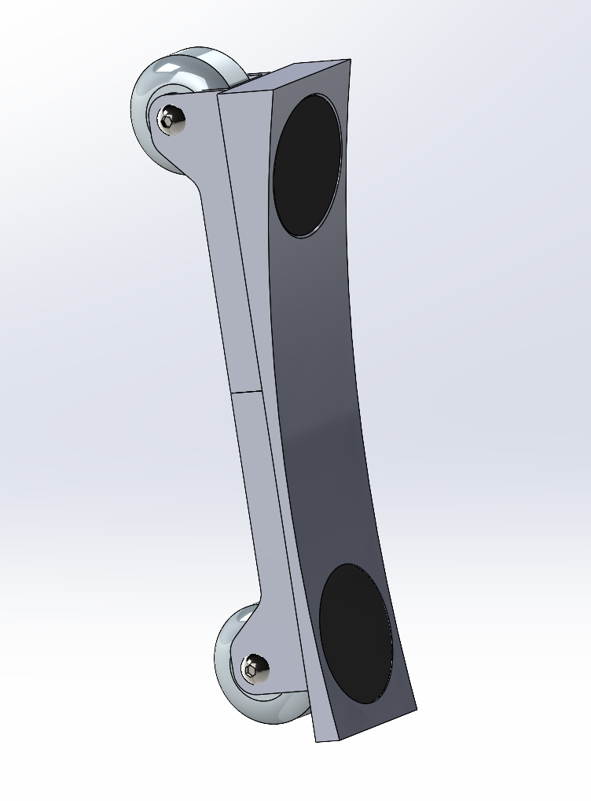  
Вид установленных роллеров  
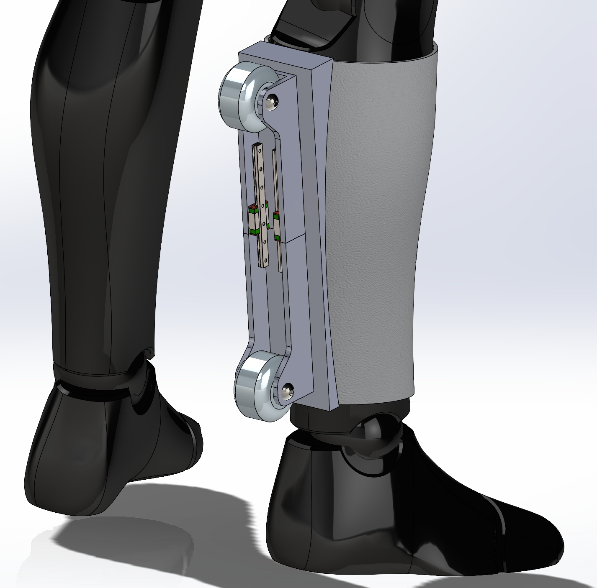  
На изображении видны рельсовые направляющие в самой колёсной сборке, необходимость в них показана ниже. Корпус роллеров я пока не делал, поэтому колёса и сборка роллеров торчат наружу. Также не показаны ретраторы (2 шт), должны располагаться рядом с верхним колесом роллерной сборки, которые должны удерживать сборку роллеров в такой позиции  
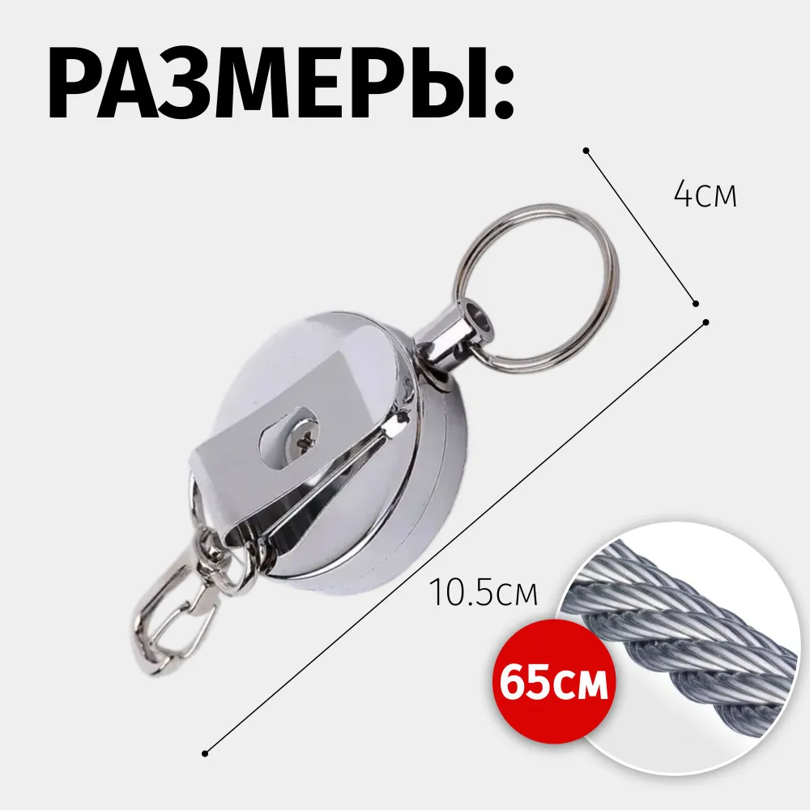  

Когда нужно поехать, человек второй ногой тянет за лямку/рукоять, которая прикреплена к переднему колесу, и вытаскивает роллерную сборку из корпуса, и наступает ногой на эту сборку  
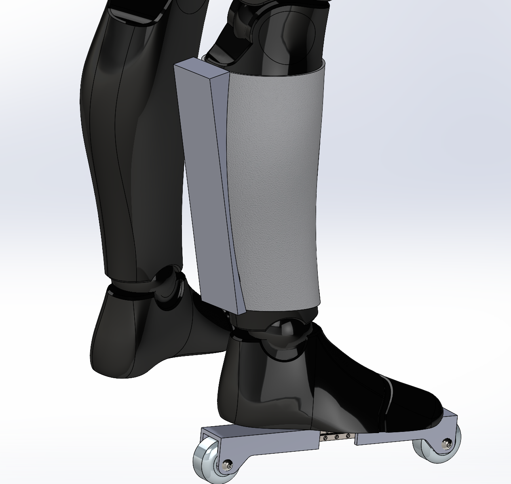  
На роллерной сборке также нет ограничителя, который должен быть у переднего колеса, который должен надеваться на мысок стопы, тем самым, чтобы не слетал во время езды.

Когда нужно убрать роллеры обратно, человек просто поворачивает носок стопы, удерживая роллеры второй ногой, роллеры соскакивают со стопы, и втягиваются ретракторами обратно в кожух.

